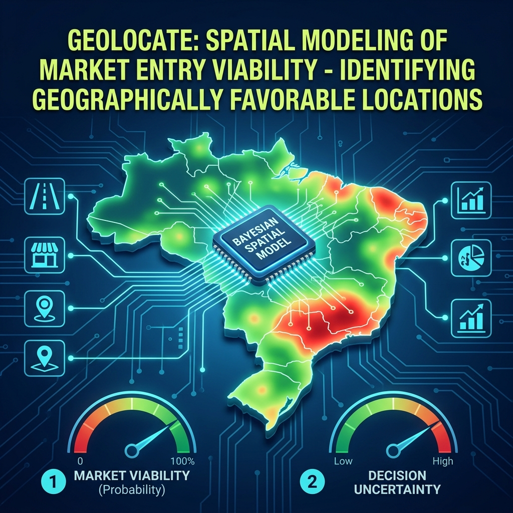

# Geolocate: Spatial Modeling of Market Entry Viability

<p align="center">
  
</p>

<p align="center">
  <strong>A Bayesian Spatial AI Framework for identifying geographically favorable market entry locations across Brazilian municipalities.</strong>
</p>

<p align="center">
  <a href="https://github.com/rtjaiany/succesful_areas/tree/bayes_model"></a>
  
  
  
  <a href="https://creativecommons.org/licenses/by-nc-sa/4.0/"></a>
</p>

---

## Overview

Deciding the spatial location for market entry is one of the most critical strategic decisions for firms seeking sustained growth. Nearly **50% of new ventures fail within their first five years**, with 35% of failures occurring because the product or service does not meet an actual market need. Existing frameworks overlook **spatial heterogeneity** — the geographic variation in infrastructure, accessibility, demographics, and economic activity that shapes real market opportunities.

**Geolocate** addresses this gap by integrating multi-source geospatial and socioeconomic data into a rigorous **Bayesian Spatial AI framework** (BYM2 model) to quantify business survival probability across +1000 Brazilian municipalities and identify geographically favorable locations for market entry.

---

## Core Contribution: `geolocate.ipynb`

The central artifact of this project is the [`geolocate.ipynb`](notebooks/geolocate.ipynb) notebook — a fully documented, end-to-end spatial analysis pipeline. It covers:

### 1. Multi-Source Data Integration

Four complementary data sources are fused at the municipality level:

| Source                                                     | Type                    | Variables                                  |
| ---------------------------------------------------------- | ----------------------- | ------------------------------------------ |
| **OpenStreetMap (OSM)**                                    | Road networks           | Road density, intersections                |
| **Google Earth Engine (Sentinel-2)**                       | Remote sensing          | NDVI, EVI, NDBI                            |
| **Brazilian Institute of Geography and Statistics (IBGE)** | Census / Administrative | GDP, HDI, population, urbanization         |
| **Brazilian Federal Revenue (RFB)**                        | Business registry       | Active/failed firms (survival rate target) |

### 2. Data Preprocessing Pipeline

- **Financial type conversion** — Parsing government-encoded numeric strings (e.g., `"1.500,00"`) into `float64`.
- **Median imputation** — Robust to right-skewed municipal distributions; applied domain-independently to SP (n=645) and RS (n=499).
- **Z-score standardization** — All 27 candidate predictors normalized for stable HMC sampling.
- **Queen contiguity graph** — Spatial adjacency matrix including island detection and correction (e.g., coastal municipalities like Ilhabela, SP).

### 3. Bayesian Lasso Variable Selection

A full Bayesian Lasso with Laplace (double-exponential) shrinkage priors:

$$\beta_j \sim \text{Laplace}(0,\ b), \quad b = 1.0$$

Variables are retained using a **94% HDI zero-exclusion rule**. Out of 27 candidate covariates, **3 robust drivers** are identified:

| Predictor                       | Coefficient (β̄) | Direction   |
| ------------------------------- | --------------- | ----------- |
| HDI Income                      | ≈ +0.041        | ✅ Positive |
| Distance to Capital             | ≈ −0.067        | ✅ Negative |
| Urbanization via public streets | ≈ +0.001        | ✅ Positive |

### 4. BYM2 Bayesian Spatial Model

The primary model — the **Besag–York–Mollié 2 (BYM2)** formulation — decomposes spatial variation into structured and unstructured components:

$$\text{logit}(p_i) = \alpha + \mathbf{X}_i\boldsymbol{\beta} + \sigma\left(\sqrt{\frac{\rho}{s}} \cdot \phi_i + \sqrt{1-\rho} \cdot \theta_i\right)$$

Where:

- **φ_i** (structured): ICAR component capturing regional spillover effects.
- **θ_i** (unstructured): IID Gaussian effects for municipality-specific noise.
- **ρ** (mixing): Beta prior balancing spatial structure vs. local variance.
- Likelihood: **Beta–Binomial** with κ ~ HalfNormal(50) to account for overdispersion.

> **Key finding**: ≈85% of variance is governed by latent spatial dependence, not covariates alone.

### 5. Model Diagnostics & Validation

| Diagnostic                   | Method                           | Result                                                 |
| ---------------------------- | -------------------------------- | ------------------------------------------------------ |
| **Convergence**              | R̂ for all parameters             | R̂ ≤ 1.03 (all chains converged)                        |
| **Model Comparison**         | PSIS-LOO (ELPD)                  | BYM2: −3,737.1 vs. Baseline: −3,766.1 (+29 units gain) |
| **Calibration**              | Posterior Predictive Check (PPC) | Model reproduces observed data distribution            |
| **Residual Autocorrelation** | Moran's I on residuals           | I = 0.0017, p = 0.451 (no residual autocorrelation)    |
| **Spatial Generalization**   | Block K-Fold Cross-Validation    | Validates across administrative domains                |

### 6. Strategic Site Classification

Municipalities are classified into **four strategic quadrants** based on posterior success probability and uncertainty:

| Quadrant                  | Description                               |
| ------------------------- | ----------------------------------------- |
| 🟢 **Safe Opportunity**   | High success probability, low uncertainty |
| 🟡 **Emerging Potential** | Moderate success, improving trajectory    |
| 🟠 **Data-Sparse**        | Uncertainty due to limited observations   |
| 🔴 **Risk Zone**          | Structurally constrained, low viability   |

A **Spider/Radar Chart** visualizes the structural profiles of each quadrant based on the top Bayesian-selected drivers.

### 7. Sectoral & Regional Sensitivity

The framework extends beyond aggregate analysis into:

- **Sectoral specificity**: Separate models for **Retail** and **Food & Beverage** sub-sectors, visualized with KDE shrinkage plots.
- **Domain validation**: Full replication on **Rio Grande do Sul** (N = 499) to test stability across diverse political and economic geographies.
- **Subpopulation sensitivity**: Evaluating model robustness across sub-divisions of the market.

---

## 📦 Data Pipeline (Supporting Infrastructure)

The `geolocate.ipynb` notebook consumes a master dataset built by an upstream pipeline:

```text
Step 1: IBGE Boundaries
  └─ python src/ibge/collect_municipalities.py --year 2022

Step 2: Physical Data Collection
  ├─ python src/satellite/extract_embeddings.py   # NDVI, EVI, NDBI via GEE
  └─ python src/osm/collect_osm_data.py           # PBF processing

Step 3: Road Infrastructure Analytics
  └─ python src/treatment/calculate_road_metrics.py --chunk-size 150000

Step 4: Final Integration
  └─ python src/treatment/integrate_final_dataset.py
       → data/processed/final_integrated_dataset.csv

Step 5: Analysis & Modeling (Core)
  ├─ jupyter notebook notebooks/geolocate.ipynb   ← MAIN
  └─ jupyter notebook notebooks/eda.ipynb
```

---

## 🗂️ Project Structure

```text
succesful_areas/
├── 📂 notebooks/                   # ⭐ Core analysis & pipelines
│   ├── geolocate.ipynb             # Main spatial model (BYM2)
│   ├── requirements_geolocate.txt  # Notebook-specific dependencies
│   └── eda.ipynb                   # Supplementary EDA
├── 📂 src/
│   ├── satellite/                  # GEE spectral extraction
│   ├── osm/                        # OSM PBF processing
│   ├── ibge/                       # Municipality boundaries
│   ├── treatment/                  # Data cleaning & integration
│   └── utils/                      # Auth, logging, memory helpers
├── 📂 data/
│   ├── raw/                        # Source datasets (Gitignored)
│   └── processed/                  # final_integrated_dataset.csv (Gitignored)
├── 📂 docs/
│   ├── assets/cover.png
│   ├── bayesian_modeling.md        # Full methodology reference
│   ├── QUICKSTART.md
│   ├── osm_data.md                  # Consolidated OSM pipeline
│   ├── MEMORY_OPTIMIZATION.md
│   ├── satellite_data.md
│   └── socioeconomic_data.md
├── requirements.txt                # Full project dependencies
└── config/
``````

---

## 🚀 Quick Start

### 1. Clone & Install

```bash
git clone git@github.com:rtjaiany/succesful_areas.git
cd succesful_areas
git checkout bayes_model
```

**Option A — pip (geolocate notebook only):**

```bash
pip install -r notebooks/requirements_geolocate.txt
```

**Option B — pip (full pipeline):**

```bash
pip install -r requirements.txt
```

### 2. Configure GEE (pipeline only)

```bash
cp config/.env.example .env
# Set your GEE_PROJECT_ID in .env
```

### 3. Run the Core Model

```bash
jupyter notebook notebooks/geolocate.ipynb
```

---

## 📚 Documentation

| Document                                           | Description                                    |
| -------------------------------------------------- | ---------------------------------------------- |
| [Bayesian Modeling](docs/bayesian_modeling.md)     | BYM2 specification, diagnostics, sectoral KDE  |
| [Quick Start](docs/QUICKSTART.md)                  | Full pipeline from data collection to modeling |
| [OSM Pipeline](docs/osm_data.md)                   | Infrastructure and POI extraction details      |
| [Satellite Data](docs/satellite_data.md)           | GEE extraction, spectral indices, embeddings   |
| [Socioeconomic Data](docs/socioeconomic_data.md)   | Business registry variables and processing     |
| [Memory Optimization](docs/MEMORY_OPTIMIZATION.md) | 8GB RAM-optimized road network processing      |

---

## Contact

- **Jaiany Rocha** — jaiany.trindade@ufrgs.br
- **Devika Jain** — kakkar@fas.harvard.edu
- **Vinicius Brei** — brei@ufrgs.br

---

## 📄 License

This project is licensed under the **[Creative Commons Attribution-NonCommercial-ShareAlike 4.0 International (CC BY-NC-SA 4.0)](https://creativecommons.org/licenses/by-nc-sa/4.0/)** License.

You are free to share and adapt the material, provided you give appropriate credit, do not use the material for commercial purposes, and distribute your contributions under the same license.
